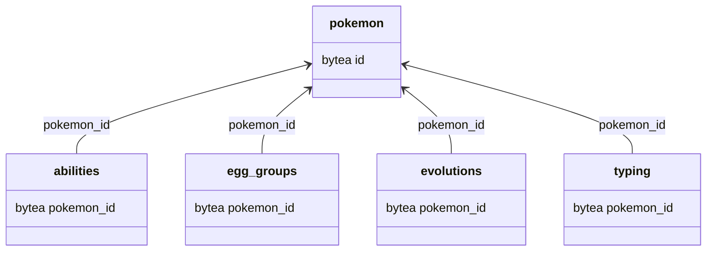

# Pokemon database schema

The `schema.sql` file contains the schema for the Pokemon database.
There are 5 tables in the database:
- abilities
- egg_groups
- evolutions
- pokemon
- typing

The schema is as follows:

