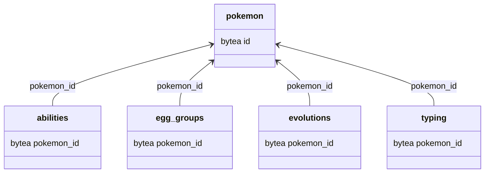

# Pokémon database schema

The `schema.sql` file contains the schema for the Pokemon database.
There are 5 tables in the database:
- abilities
- egg_groups
- evolutions
- pokemon
- typing

The schema is as follows:




## Analytical queries

What evelutions are there for each pokémon?

```sql
SELECT
    b.name AS pokemon,
    string_agg(a.name, ', ') AS evolves_into
FROM
    evolutions
LEFT JOIN
    pokemon a ON a.id = evolutions.pokemon_id
LEFT JOIN
    pokemon b ON b.id = evolutions.evolves_from
GROUP BY
    b.name
order by count(b.name) desc;
```
